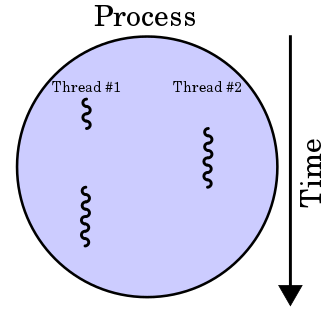
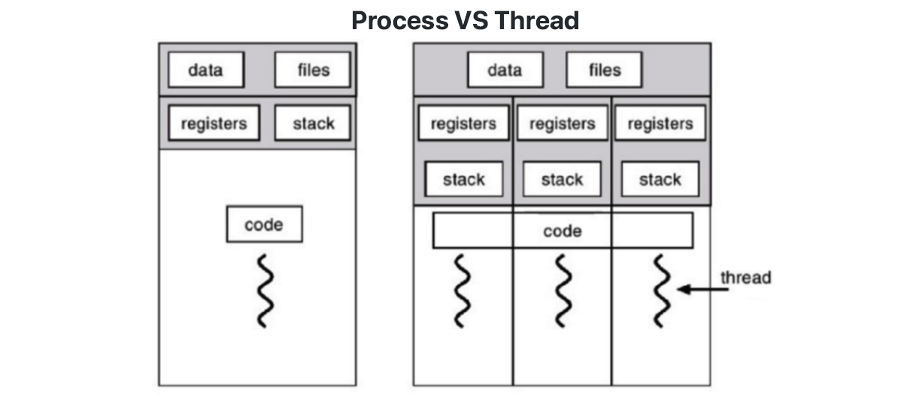
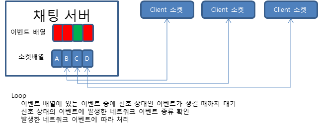
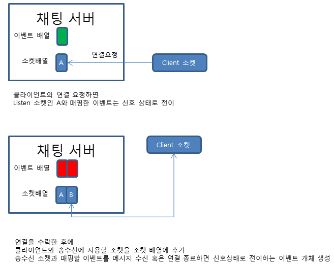
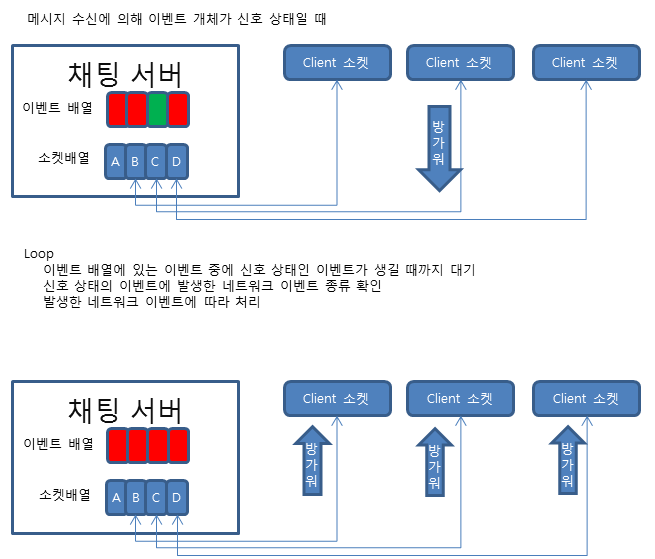
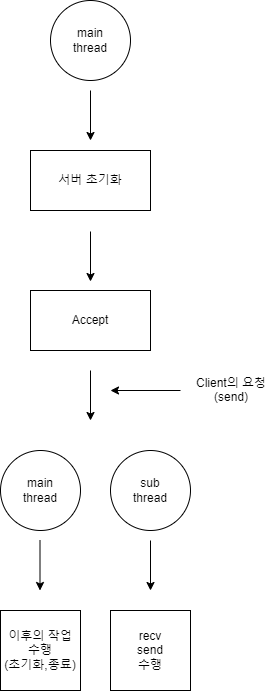

# project_oneclick

## 2022 mini project - socket programming with C [미니 프로젝트]

* [Markdown 문법 사용하기](http://whatismarkdown.com/)


* [git add Permision denied 관련 해결](https://openingsound.tistory.com/95)


* [telent 사용하기](https://opentutorials.org/module/2160/12506) - cmd 실행 후 telnet localhost port번호 입력 (ex) telnet localhost 9090)


# 1. 프로젝트 개요
## 1.1 TCP/IP 프로토콜 기반 소켓 통신 구현하기 with C
[TCP/IP 통신이란?](https://www.ibm.com/docs/ko/aix/7.1?topic=management-transmission-control-protocolinternet-protocol) 컴퓨터가 서로 통신하는 경우, 특정 규칙이나 프로토콜을 사용하여 순서대로 데이터를 전송 및 수신할 수 있다. 전 세계를 통해 가장 일상적으로 사용되는 프로토콜 세트 중 하나가 TCP/IP(Transmission Control Protocol/Internet Protocol)이다. TCP/IP는 네트워크에 연결된 여러 Host 사이의 통신을 허용한다. 하드웨어에 구애받지 않고, 여러 컴퓨터를 제어할 수 있다는 점에서 TCP/IP 및 소켓 통신 기반의 간단한 메신저를 만들어보고자 한다. 


## 1.2. Socket 통신 사용하기
[소켓 통신이란?](https://kotlinworld.com/75) 소켓(Socket)은 프로세스가 드넓은 네트워크 세계로 데이터를 내보내거나 혹은 그 세계로부터 데이터를 받기 위한 실제적인 창구 역할을 한다. 그러므로 프로세스가 데이터를 보내거나 받기 위해서는 반드시 소켓을 열어서 소켓에 데이터를 써 보내거나 소켓으로부터 데이터를 읽어 들여야 한다. 소켓은 <u> 프로토콜, IP, 포트</u>로 정의된다.

### 1.2.1 용어정리
* <b>프로토콜</b> - 어떤 시스템이 다른 시스템과 통신을 원활하게 수행하도록 해주는 통신 규약

* <b>IP</b> - 전 세계 컴퓨터에 부여된 고유의 식별 주소

* <b>포트</b> - 네트워크상에서 통신하기 위해서 호스트 내부적으로 프로세스가 할당받아야 하는 고유한 숫자. 한 호스트 내에서 네트워크 통신을 하는 프로세스를 식별하기 위해 사용되는 값으로, 같은 호스트 내에서 서로 다른 프로세스가 같은 포트 넘버를 가질 수 없다. 같은 컴퓨터 내에서 프로그램을 식별하는 번호

### 1.2.2 소켓 통신 흐름

> * <span style="color:00AFFF"><b>SERVER</b></span> : 클라이언트에서 접속할 때까지 Listen 상태로 대기한다. 클라이언트의 연결 요청이 오면 accept를 통해 접속을 허락한다. Server socket을 생성할 때, 사용할 프로토콜, IP, 포트 번호를 지정해 준다.  
> * <span style="color:00AFFF"><b>CLIENT</b></span> : 서버와 같은 프로토콜, 서버의 IP 및 포트 번호를 사용해 Socket을 생성하고 서버와 통신할 수 있다.

### 1.2.3 정리
소켓은 기본적으로 Connection 기반의 양방향 통신이다. 서버와 클라이언트 모두 Socket이 필요하며, 해당 Socket이 연결된 상태에서 통신이 가능하다. 따라서 서버가 클라이언트로 메시지를 보내고 받을 수 있지만, 클라이언트 역시 서버로 메시지를 보내고 받을 수 있다. 이 Connection이 계속해서 유지되기 때문에 스트리밍이나 실시간 채팅 등 실시간 데이터 교환에서 이점이 있다. 하지만 계속해서 Connection을 유지해야 하는 부분에서 많은 리소스가 소모된다는 단점이 있다.  

## 1.3 스레드

<p align ="center"></p>

프로그램내에서, 특히 프로세스 내에서 실행되는 흐름의 단위이다. 한 프로그램은 하나의 스레드를 가지고 있지만, 프로그램 환경에 따라 이상의 스레드를 동시에 실행할 수 있다.

### 1.3.1 멀티프로세스 VS 멀티스레드
|제목|<center>멀티프로세스</center>|<center>멀티스레드</center>|
|------|---|---|
|개념|<center>병렬처리 </br><center>각 프로세스 간 메모리 구분이 필요하거나 독립된 주소 공간을 가져야 할 경우 사용|<center>하나의 프로세스에 여러 스레드로 자원을 공유하며 작업을 나누어 수행|
|장점|<center> 안전성 높음 </br> <center> 프로세스 중 하나에 문제가 생겨도 다른 프로세스에 영향을 주지 않음 </br><center> 여러개의 프로세스가 처리되어야 할 때 동일한 데이터 사용, 비용적 저렴|<center> 자원의 효율성 증대</br> <center> 처리비용 감소 </br> <center> 간단한 통신 방법으로 프로그램 응답시간 단축|
|단점| <center>작업량이 많을수록 오버헤드 발생(Context Switching자주 발생) -> 성능저하 |<center> 공유하기에 동기화 문제 발생 가능 </br> <center>설계 중요, 디버깅 어려움 </br> <center> 하나의 스레드 문제 발생 -> 전체 프로세스 영향 </br> <center> 단일 프로세스 시스템의 경우 효과 어려움|

 * Context Switching? 현재 진행하고 있는 Task의 상태를 저장하고 다음 진행할 Task의 상태 값을 읽어 적용하는 과정

### 1.3.2 스레드 데이터
<p align ="center"></p>

* 스레드 기본 데이터: 하나의 실행 흐름이므로 실행과 관련된 데이터가 필요하다. 일반적으로 스레드는 자신만의 고유한 스레드 ID, 프로그램 카운터, 레지스터 집합, 스택을 가진다. 코드, 데이터, 파일 등 기타 자원은 프로세스 내의 다른 스레드와 공유한다.
* 스레드 특정 데이터: 위의 기본 데이터 외에도 하나의 스레드에만 연관된 데이터가 필요한 경우가 있는데, 이런 데이터를 말한다. 멀티스레드 프로그래밍 환경에서 모든 스레드는 프로세스의 데이터를 공유하고 있지만, 특별한 경우에는 개별 스레드만의 자료 공간이 필요하다.


# 2. 프로젝트 구현
## 2.1 개발 환경
* Visual Studio 2022
* Operating System - Windows 10
## 2.2 SERVER-CLIENT : Basic Socket Communication
</br>
<p align ="center"></p>

* <em>socket()</em> - 서버에서 사용 할 소켓을 생성하는 함수
* <em>bind()</em> - 생성한 소켓에 사용할 프로토콜, IP, 포트 넘버를 부여하고 BIND하는 함수
* <em>listen()</em> - 서버에서 클라이언트의 요청이 오는지 확인하는 함수
* <em>accpet()</em> - 클라이언트에서 connect 연결 요청이 왔을 때, 해당 연결을 허용하는 함수
* <em>recv()/send()</em> - 서버 및 클라이언트 소켓에서 데이터를 송/수신하는 함수
* <em>closesocket()</em> - 생성된 소켓 소멸하는 함수

### 2.2.1 Implementation - SERVER  

#### 2.2.1.1 Headers & 전처리
```C
#pragma comment(lib,"ws2_32.lib")  // winsock2를 사용하기 위한 lib를 추가합니다.
#include <Winsock2.h>
#define _WINSOCK_DEPRECATED_NO_WARNINGS
#define _CRT_SECURE_NO_WARNINGS
#define SERVER_IP "127.0.0.1"
#define SERVER_PORT 9090
```
1. 윈도우 환경에서 소켓을 사용하기 위한 외부 라이브러리 추가
2. Visual studio에서 소켓을 사용하기 위한 Winsock2.h 헤더파일 추가
3. 사용할 IP 및 포트 설정(프로젝트에서는 로컬 IP 주소를 사용했음)  

#### 2.2.1.2 Winsock 초기화
```C
WSADATA wsaData;

// 1. Winsock 초기화, WINSOCK VERSION 2.2
if (WSAStartup(MAKEWORD(2, 2), &wsaData) != 0) {
	printf("WSAStartup failed: %d\n", WSAStartup(MAKEWORD(2, 2), &wsaData));
	return 1;
}
else {
	Sleep(2000);
	printf("WSAStartup completed!!\n");
}

```
1. Winsock을 초기화하는 부분이다.
2. WSAStartup은 Winsock의 속성 정보를 자동으로 설정해준다.
3. 실제로 소켓 프로그래밍을 할 때 사용할 일은 없지만, 하위 버전과의 호환성을 맞추어준다는 부분에서 꼭 설정해야 한다.

#### 2.2.1.3 Socket 생성
```C
SOCKET serverSocket; // 소켓 인스턴스
struct sockaddr_in server; // 프로토콜, IP, 포트 설정을 위한 구조체

        // 2. 초기화 후 서버에서 사용할 SOCKET 인스턴스 생성
	// socket() function is used to create a socket
	if ((serverSocket = socket(AF_INET, SOCK_STREAM, 0)) == INVALID_SOCKET) {
		printf("Could not create socket : %d\n", WSAGetLastError());
		exit(EXIT_FAILURE);
	}
	else {
		Sleep(2000);
		printf("Socket has been created!\n");
		// Address Family : AF_INET ( = IPv4)
		// Type : SOCK_STREAM( = TCP Protocol connection)
		// Protocol : 0
	}
        //server.sin_addr.s_addr = INADDR_ANY; // 자동으로 이 컴퓨터에 존재하는 랜카드 중 사용가능한 랜카드의 IP주소 사용
	server.sin_addr.s_addr = inet_addr("127.0.0.1");
	server.sin_family = AF_INET; // IPv4
	server.sin_port = htons(9090); // 사용할 포트 번호 지정
```
1. socket() 함수를 통해 소켓 인스턴스를 만들어 준다.
2. sockaddr_in 구조체 server에 서버가 사용할 통신방법, IP, 포트 번호를 할당해 놓는다.
3. INADDR_ANY를 통해 자동으로 컴퓨터에 존재하는 랜카드 ip주소를 할당해 줄 수있다. 이 방법을 사용하는 것이 호환성 부분에서 좀 더 유연하기 때문에 사용하는 것이 좋다.

#### 2.2.1.4 컴퓨터 네트워크에 Bind
```C
// 3. Socket 생성 후 Bind
	if (bind(serverSocket, (struct sockaddr*)&server, sizeof(server)) == SOCKET_ERROR) {
		printf("Bind failed with error code : %d\n", WSAGetLastError());
		exit(EXIT_FAILURE);
	}
	else {
		Sleep(2000);
		printf("Bind done!\n");
	}
```
1. bind() 함수를 통해 소켓이 사용할 네트워크 정보를 바인딩 해준다.
2. 이전 단계에서 생성했던 sockaddr_in 구조체 server에 할당했던 통신방법, ip정보, 포트 넘버가 소켓 및 네트워크에 할당되는 단계이다.

#### 2.2.1.5 서버에서 listen을 통해 클라이언트의 연결 요청을 대기
```C
        // 4. Socket에서 Listen을 통해 수신 대기
	if (listen(serverSocket, SOMAXCONN) == SOCKET_ERROR) {
		printf("Listen failed with error: %ld\n", WSAGetLastError());
		closesocket(serverSocket);
		WSACleanup();
		return 1;
	}
	else {
		Sleep(2000);
		printf("Waiting for incoming connections...\n");
	}
```
1. listen()함수를 통해 클라이언트의 연결 요청을 감지한다

#### 2.2.1.6 서버에서 클라이언트의 요청을 accept
```C
SOCKET clientSocket;

        // 5. Client의 연결 요청을 수락하기
	clientSocket = INVALID_SOCKET;
	clientSocket = accept(serverSocket, NULL, NULL);
	if (clientSocket == INVALID_SOCKET) {
		printf("accept failed: %d\n", WSAGetLastError());
		closesocket(serverSocket);
		WSACleanup();
		return 1;
	}
	else {
		printf("Connection accepted!\n");
	}
```
1. 서버의 소켓을 통해 accept 된 클라이언트의 정보를 clientSocket에 넣는다
2. 해당 클라이언트에서 전송한 정보들이 clientSocket에 저장되는 형식

#### 2.2.1.7 서버 종료 및 Winsock 초기화
```C
        closesocket(clientSocket);
	closesocket(serverSocket);
	WSACleanup();
```
1. 사용했던 서버 및 받아온 클라이언트 소켓 종료 및 초기화
2. 사용한 Winsock 초기화

### 2.2.2 Implementation - CLIENT
#### 2.2.2.1 Headers & 전처리
```C
#pragma comment(lib,"ws2_32.lib")  // winsock2를 사용하기 위한 lib를 추가합니다.
#include <stdio.h>
#include <stdlib.h>
#include <WinSock2.h>
#include <process.h>
#define _WINSOCK_DEPRECATED_NO_WARNINGS
#define _CRT_SECURE_NO_WARNINGS
#define DEFAULT_PORT "27015"
#define MY_LOCAL_IP "127.0.0.1"
```
1. 윈도우 환경에서 소켓을 사용하기 위한 외부 라이브러리 추가
2. Visual studio에서 소켓을 사용하기 위한 Winsock2.h 헤더파일 추가
3. 사용할 IP및 포트 설정(프로젝트에서는 로컬 IP주소를 사용했음)

#### 2.2.2.2 Winsock 초기화
```C
        // initializing Winsock
        printf("Initializing Winsock...\n");
        // 1. Winsock 초기화, WINSOCK VERSION 2.2
        if (WSAStartup(MAKEWORD(2, 2), &wsaData) != 0) {
                printf("WSAStartup failed: %d\n", WSAStartup(MAKEWORD(2, 2), &wsaData));
                return 1;
        }
        else {
                Sleep(2000);
                printf("WSAStartup completed!!\n");
        }
```
1. Winsock을 초기화하는 부분이다.
2. WSAStartup은 Winsock의 속성 정보를 자동으로 설정해준다.
3. 실제로 소켓 프로그래밍을 할 때 사용할 일은 없지만, 하위 버전과의 호환성을 맞추어준다는 부분에서 꼭 설정해야 한다.

#### 2.2.2.3 Socket 생성
```C
    // 2. Creating socket
    // 2. 초기화 후 서버에서 사용할 SOCKET 인스턴스 생성
    // socket() function is used to create a socket
    if ((clientSocket = socket(AF_INET, SOCK_STREAM, 0)) == INVALID_SOCKET) {
        printf("Could not create socket : %d\n", WSAGetLastError());
    }
    else {
        Sleep(2000);
        printf("Socket has been created!\n");
        // Address Family : AF_INET ( = IPv4)
        // Type : SOCK_STREAM( = TCP Protocol connection)
        // Protocol : 0
    }
    server.sin_addr.s_addr = inet_addr(MY_LOCAL_IP); // 서버 IP
    server.sin_family = AF_INET; // IPv4
    server.sin_port = htons(9090); // 사용할 포트 번호 지정
```
1. socket() 함수를 통해 소켓 인스턴스를 만들어 준다.
2. sockaddr_in 구조체 server에 클라이언트가 사용할 통신방법, IP, 포트 번호를 할당해 놓는다.
3. INADDR_ANY를 통해 자동으로 컴퓨터에 존재하는 랜카드 ip주소를 할당해 줄 수있다. 이 방법을 사용하는 것이 호환성 부분에서 좀 더 유연하기 때문에 사용하는 것이 좋다.

#### 2.2.2.4 서버에 연결(connect) 요청
```C
    // 3. Connect to server
    if (connect(clientSocket, (struct sockaddr*)&server, sizeof(server)) < 0) {
        printf("Connect error!\n");
        return 1;
    }
    else {
        printf("Connection has been completed!\n");
    }
```
1. sockaddr_in 구조체 server에 저장해 놓았던 연결을 요청할 서버의 통신방법, IP주소, 포트 번호를 통해 서버에 연결을 요청할 수 있다.
2. connect()함수를 사용해 서버에 연결을 요청한다.

#### 2.2.2.5 클라이언트 종료 및 초기화
```C
    closesocket(clientSocket);
    WSACleanup();
```
1. 사용했던 클라이언트 소켓 종료 및 초기화
2. 사용한 Winsock 초기화

## 2.3 SERVER-CLIENT : send/recv communicatuion with Multiplexing
### 2.3.1 What is Multiplexing?
<p align ="center"></p>
  
* Basic 통신 프로그램은 서버 클라이언트 1:1 통신 방식이다.
* 클라이언트가 많아지면 1:N 통신 방식을 진행해야 한다.
* 특정 소켓의 I/O operation이 이루어질 때 해당 연산을 선택해가며 처리한다
* 많은 연산, 많은 메모리 공간 요구, IPC 방법이 복잡하다는 단점이 있다.

### 2.3.2 프로그램 설계
<p align ="center"></p>  

* 클라이언트에서 서버로 연결 요청
* 서버에서 관리하는 클라이언트 소켓 배열에 넣고 이벤트 관리

<p align = "center"></p>

* 특정 소켓에서 메시지 send 이벤트를 발생시킨 경우
* 신호 상태의 이벤트에 발생한 네트워크 이벤트 종류 확인
* 발생한 네트워크 이벤트에 맞게 처리

### 2.3.3 Implementation - SERVER
> #### SERVER Multiplexing의 Listen()까지는 이전의 코드와 같다.

#### 2.3.3.1 작동 원리
> 1. 다수의 소켓을 모니터링하며 그곳에서 '무언가가' 일어나는지 계속 모니터링한다.  

> 2. 다수의 소켓 중 하나의 소켓이 send() 액션을 취한다면, 서버는 해당 액션을 notify하고 해당 과정을 처리한다.

> 3. Winsock api는 다수의 소켓을 모니터링하며 액션을 처리할 수 있게 하는 select()함수를 제공한다.

#### 2.3.3.2 Event-driven socket programming & 비동기 소켓 프로그래밍
```C
int select(int nfds, fd_set *readfds, fd_set *writefds, fd_set *exceptfds, const struct timeval *timeout);
```
* <em>nfd</em> - dummy data
* <em>readfds</em> - readable 상태가 될 수 있는 소켓 배열을 감시하는 포인터, 만약 readfds fd_set에 있는 소켓 중 하나가 데이터를 수신하면 해당 소켓은 readable 상태가 된다.
* <em>writefds</em> - 마찬가지로 writable 상태가 될 수 있는 소켓 배열 감시
* <em>exceptfds</em> - read,write 이외의 상태를 처리하는 소켓 배열 감시
* <em>timeout</em> - select 함수가 얼마나 기다려야 하는지 정해주는 변수 

#### 2.3.3.3 read 작업을 처리할 fd_set 선언 민 초기화
```C
        SOCKET s; // client 소켓 처리하기 위한 소켓
        fd_set readfds; // Set of socket descriptors
        SOCKET client_socket[30]; // number of clients

        // initializing client_socket[30]
        for (int i = 0; i < 30; i++) {
	        client_socket[i] = 0;
        }
```

#### 2.3.3.4 클라이언트의 요청을 accept 하고 해당 소켓을 readfds fd_set으로 관리한다
```C
        // clear the fd_set
        FD_ZERO(&readfds); 

        // add server socket to fd set
        FD_SET(serverSocket, &readfds);

        // add child sockets to fd set
        for (int i = 0; i < max_clients; i++) {
		s = client_socket[i];
		if (s > 0) {
		        FD_SET(s, &readfds);
		}
        }
```
1. 서버소켓을 fd_set에 넣는 이유 : 클라이언트들의 연결 요청을 처리하기 위함
2. 만약 클라이언트가 접속해 있다면, 해당 클라이언트의 요청을 처리하기 위해 fd_set에 추가함
#### 2.3.3.5 select 함수를 사용해 어떠한 행동을 해야할지 정한다
```C
        // wait for an activity on any of the sockets, timeout = NULL -> 무한대로 기다림
	activity = select(0, &readfds, NULL, NULL, NULL);
        
        if (activity == SOCKET_ERROR) {
		perror("accept error");
		exit(EXIT_FAILURE);
	}
```
1. 설정한 fd_set readfds에서 무슨 일이 일어나는지 모니터링 한다
2. 어떠한 액션이 일어나게 되면 activity 변수에 저장된다.

#### 2.3.3.6 FD_ISSET을 통해 서버의 connection 관련 행동을 accept함수로 처리
```C
        // 만약 server socket에서 무슨 일이 일어난다 -> 연결 요청이 들어오는 것
	if (FD_ISSET(serverSocket, &readfds)) {
		if ((newSocket = accept(serverSocket, (struct sockaddr*)&address, (int*)&addrlen)) < 0) {
			perror("accept");
			exit(EXIT_FAILURE);
		}
        }
```
1. FD_ISSET은 fd_set에서 특정 소켓에 무슨 일이 일어나는지 체크하는 함수
2. 만약 무슨 일이 일어났다면, serverSocket의 경우 클라이언트의 연결 요청을 처리하는 일
3. 클라이언트의 connect 요청을 accept로 처리해 준다.

#### 2.3.3.7 연결된 클라이언트들을 client_socket[30]에 넣어 관리한다.
```C
        // 만약 server socket에서 무슨 일이 일어난다 -> 연결 요청이 들어오는 것
	if (FD_ISSET(serverSocket, &readfds)) {
		if ((newSocket = accept(serverSocket, (struct sockaddr*)&address, (int*)&addrlen)) < 0) {
			perror("accept");
			exit(EXIT_FAILURE);
		}
        // add new socket to array of sockets
		for (int i = 0; i < max_clients; i++) {
			if (client_socket[i] == 0) {
				client_socket[i] = newSocket;
				printf("Adding to list of sockets at index %d\n", i);
				break;
			}
		}
        }
```
1. 각각의 클라이언트 요청들을 처리
2. 만약 해당 배열이 비어있으면, 그곳으로 클라이언트를 넣어 관리해준다.

#### 2.3.3.8 serverSocket이 아니라, 다른 소켓에 의한 I/O operation 요청일 경우
```C
        for(int i = 0; i < max_clients; i++){
                s = client_socket[i]; // 모든 소켓을 돌면서 처리
                
                // 만약 해당 클라이언트가 어떠한 행동을 한다면(여기서는 read)
                if(FD_ISSET(s,&readfds)){
                        // get details of the client
                        getpeername(s, (struct sockaddr* )&address, (int*)&addrlen);
                        /* =================================================
                         * send(), recv() 작업 처리하기(client의 요청에 맞게)
                         * ================================================= */
                }
        }
```

#### 2.3.3.9 서버 종료 및 초기화
```C
closesocket(newSocket);
closesocket(serverSocket);
WSACleanup();
```
1. 사용했던 서버 및 받아온 클라이언트 소켓 종료 및 초기화
2. 사용한 Winsock 초기화

### 2.3.4 Implementation - CLIENT
> #### CLIENT Multiplexing의 작동 원리는 이전 코드와 같다.
> 하지만 message data를 서버에게 send하고 서버의 응답을 recv 하는 부분이 추가되었다.
#### 2.3.4.1 서버에게 나의 message data를 send하기
```C
        // send data
        message = "message to server from client!";
        if (send(clientSocket, message, strlen(message), 0) < 0) {
            printf("Send failed!\n");
            return 1;
        }
        else {
            printf("Message send : %s\n", message);
        }
```
1. send() 함수를 사용해 연결되어있는 서버에게 메시지를 보낼 수 있다.
2. 현재 clientSocket을 통해 서버와 연결되어 있고, 해당 소켓을 통해 message를 send한다.

#### 2.3.4.2 서버로부터 message data를 receive 하기
```C
        // 5. Receive reply from server
        if ((recv_size = recv(clientSocket, server_reply, 2000, 0)) == SOCKET_ERROR) {
            printf("Receive failed!\n");
        }
        else {
            printf("Message received : ");
            server_reply[recv_size] = '\0';
            puts(server_reply);
        }
```
1. recv 함수는 send함수와 이름만 다를 뿐, 사용 방법은 같다.
2. 마찬가지로 서버와 연결되어 있는 clientSocket을 통해 서버의 메시지를 받는다.
3. recv 함수는 메시지를 받은 경우 해당 메시지의 길이를 return한다(recv_size).

## 2.4 SERVER-CLIENT : send/recv communicatuion with Multi-Thread
### 2.4.1 What is Multi-thread?
<p align = "center"></p>  

멀티 쓰레드란, CPU의 최대 활용을 위해 프로그램의 쓰레드를 둘 이상 실행시키는 것이다. Context switching 속도가 굉장히 빠르기 때문에 사용자 입장에서는 동시에 작업이 수행되는 것 처럼 보인다.

### 2.4.2 Multi-thread의 흐름 과정
<p align = "center"></p>  
<p align = "center">멀티쓰레드에서 작업이 수행되는 과정</p>

### 2.4.3 프로그램 설계
<p align = "center"></p>

* main_thread는 서버 초기화 및 연결 , 소켓의 종료를 수행한다
* 만약 클라이언트로부터 작업 요청이 온다면, 해당 작업은 쓰레드를 새로 생성해 생성된 쓰레드가 수행한다.
* send 작업은 main_thread가 담당한다, recv 작업을 쓰레드로 나누어서 처리하는 이유는 서버는 하나지만 client는 다수가 존재한다.
* 다수의 클라이언트에서 들어오는 요청을 recv로 처리할 때 쓰레드를 통해 해결한다.

### 2.4.4 Implementation - SERVER
> #### SERVER multi_threading의 Listen()까지는 이전의 코드와 같다.
#### 2.4.4.1 Headers & 전처리, 전역변수 선언
```C
#pragma comment(lib,"ws2_32.lib")  // winsock2를 사용하기 위한 lib를 추가합니다.
#include <stdio.h>
#include <WinSock2.h>
#include <process.h>
#include <string.h>
#define _WINSOCK_DEPRECATED_NO_WARNINGS
#define _CRT_SECURE_NO_WARNINGS
#define SERVER_IP "127.0.0.1"
#define SERVER_PORT 9090
#define MAX_CLIENTS 20

HANDLE hMutex = 0; // 쓰레드 동기화 처리를 위한 뮤텍스
int client_num = 0; // 클라이언트 개수
int seat = 0; // 클라이언트 번호
SOCKET client_sock[65535]; // 클라이언트 welcom socket
```
1. 쓰레드의 공유 자원 처리를 위한 mutex를 사용한다.
2. 이 외의 선언은 다른 프로그램과 같다.

#### 2.4.4.2 accept 이후 recv 처리는 쓰레드를 생성하여 처리한다
```C
        //Blocking 방식으로 Client 대기
	client_sock[seat] = accept(serverSocket, (struct sockaddr*)&client, (int*) & addrlen);
	if (client_num < MAX_CLIENTS) {
		if (!(client_sock[seat] == INVALID_SOCKET || client_sock[seat] == SOCKET_ERROR)){
			_beginthread(recv_client, 0, &client_sock[seat]);
			Sleep(10);
			printf("New connection, %dth client, ip is : %s, port : %d\n", seat, inet_ntoa(client.sin_addr), ntohs(client.sin_port));
		}
	}
```
1. client_sock 배열에는 multiplexing과 마찬가지로 접속하는 클라이언트들이 들어간다
2. accept를 통해 연결이 완료된 후, recv 작업은 쓰레드가 처리한다.
3. 이 때 메인 쓰레드와 생성된 쓰레드는 병렬적으로 작업을 수행하게 된다.

#### 2.4.4.3 쓰레드가 recv를 수행하는 함수 구현
<details>
<summary>recv_client 함수 보기</summary>

```C
// 스레드 함수
void recv_client(void* ns) {
	// 정상적으로 연결요청 accpet 되었을 때 스레드 실행
	// 클라이언트의 숫자를 늘림

	// 임계 영역, mutex lock을 활용해 공동 접근 불가능하게 한다
	WaitForSingleObject(hMutex, INFINITE);
	client_num++; // 클라이언트 개수 증가
	seat++; // 클라이언트 번호 증가
	ReleaseMutex(hMutex);

	char welcome[100] = { 0 };
	char buff[1024] = { 0 };
	int ret, i;

	_itoa(seat, welcome, 10);
	strcat(welcome, "번 클라이언트, 환영합니다\n");
	ret = send(*(SOCKET*)ns, welcome, sizeof(welcome), 0); // 메시지 전송

	while (ret != SOCKET_ERROR || ret != INVALID_SOCKET) {
		ret = recv(*(SOCKET*)ns, buff, 1024, 0); //클라이언트로부터 메시지 받음

		// 모든 client에게 broadcast
		for (i = 0; i < 65535; i++) {
			// 받은 클라이언트 소켓의 메모리 주소와
			// 보내는 클라이언트의 소켓 메모리 주소가 다르면 전송
			WaitForSingleObject(hMutex, INFINITE);
			if ((unsigned*)&client_sock[i] != (SOCKET*)ns) {
				send(client_sock[i], buff, strlen(buff), 0);
			}
			ReleaseMutex(hMutex);
		}
		if (strlen(buff) != 0) {
			printf("메시지 보냄 : %s", buff);
		}
		memset(buff, 0, 1024);
	}

	// 접속된 소켓이 연결을 해제 시켰을때 
	WaitForSingleObject(hMutex,INFINITE);
	client_num--;
	ReleaseMutex(hMutex);
	ReleaseMutex(hMutex);
	return;
}
```

</details>

1. 전역 변수 client_num과 seat을 관리하기 위해 해당 임계 영역은 mutex로 관리
2. 연결이 완료되었다면, 서버에서 클라이언트로 1회 연결 확인 메시지를 보내게 된다.
3. 만약 잘 보냈다면(ret != error), 이 쓰레드는 recv 작업을 수행한다.
4. 모든 client에게 broadcast로 recieve 한 메시지를 전달한다
5. 접속한 client가 접속을 종료하면 mutex 초기화, client number 감소

#### 2.4.4.4 서버 종료 및 초기화
```C
if (client_sock[seat] == INVALID_SOCKET) {
	printf("accept error");
	closesocket(client_sock[seat]);
	closesocket(serverSocket);
	WSACleanup();
	return 1;
}
```
1. 사용했던 서버 및 받아온 클라이언트 초기화
2. 사용한 Winsock 초기화

### 2.4.5 Implementation - CLIENT
> #### CLIENT multi_threading의 connect()까지는 이전의 코드와 같다.
#### 2.4.5.1 connect가 완료되었다면 thread를 통해 recv 함수를 수행한다
```C
        // 3.5 Receive welcome message from server
	if ((ret = recv(clientSocket, buff, 1024, 0)) == SOCKET_ERROR) {
		printf("Receive failed!\n");
	}
	else {
		printf("Welcome message from server : \n");
		buff[ret] = '\0';
		puts(buff);
	}

	if (!strcmp("Client Full!\n", buff)) {
		closesocket(clientSocket);
		WSACleanup();
		return 0;
	}

	// 정상 접속이 되면 스레드 작동 - 받는 메시지 스레드 실시간 수행
	_beginthread(recv_thread, 0, NULL);
```
1. _beginthread를 통해 쓰레드 생성 후 recv 수행

#### 2.4.5.2 쓰레드가 recv를 수행하는 함수를 구현
<details>
<summary>recv_thread 함수 보기</summary>

```C
// 메시지 받는 스레드 함수
void recv_thread(void* pData) {
	int ret_thread = 65535;
	char buff_thread[1024] = { 0 };

	// 스레드용 리턴 값이 원하는 값이 아니면 받는 중에 서버와 통신이 끊긴 것
	while (ret_thread != INVALID_SOCKET || ret_thread != SOCKET_ERROR) {
		Sleep(10);

		// 서버에서 주는 메시지를 실시간으로 기다렸다가 받는다.
		ret_thread = recv(clientSocket, buff_thread, sizeof(buff_thread), 0);

		// 서버에서 받는 작업을 한 결과 비정상이면 탈출
		if (ret_thread == INVALID_SOCKET || ret_thread == SOCKET_ERROR) {
			break;
		}

		// 정상적으로 받는다면 받은 버퍼 출력
		printf("\nmessage recieve : %s", buff_thread);
		memset(buff_thread, 0, 1024); // 버퍼 초기화
	}

	// 작업 끝난 소켓 초기화
	WaitForSingleObject(hMutex, 100L);
	ret = INVALID_SOCKET;
	ReleaseMutex(hMutex);
	return;
}
```

</details>

1. 서버와 통신이 끊기지 않았다면, 무한 루프를 돌며 서버에서 주는 메시지를 기다렸다가 받는다.
2. 서버에서 받은 작업을 한 결과 비정상이면 무한 루프 탈출 후 소켓 초기화
3. 정상적으로 받았다면 받은 메시지 버퍼를 출력한다.

# 3. 프로젝트 마무리
## 3.1 문제 발생 부분
### 3.1.1 개발 환경 선택하기
개발 환경을 처음에는 운영체제 Windows 10, visual studio code editor를 활용해 직접 컴파일, 빌드를 진행할 계획이었다. 특히 빌드는 cMake를 활용해 빌드 자동화 환경을 구축하고자 했지만, 초기 환경 구축에 있어서 많은 잡음이 발생해 visual studio 통합 환경을 이용하게 되었다.

### 3.1.2 네트워크 소켓 통신
프로젝트 주제에 맞춰 프로그램을 설계하고 제작을 해야 했다. 하지만 C언어로 진행되는 low-level network programming에 익숙한 조원이 없었고, 소켓 통신에 대한 개념이 완벽하게 잡혀있지 않아 구현하는 데 많은 어려움이 있었다. 많은 예제와 tutorial들, 네트워크 공부를 통해 점차 원하는 방향으로 구현해 나갈 수 있었다.

### 3.1.3 구현 프로그램 테스트하기
네트워크 통신 특성상, 어느 한 단계라도 이루어지지 않는다면 다음 단계로 나아가지 못한다. 프로그램을 작성하고 해당 기능에 대한 단위 테스트를 진행할 때 많은 어려움이 있었다. 서버의 경우 교육장 데스크탑은 공유기를 사용하기 때문에 변환된 내부 IP를 사용하게 된다(ex)192.168.0.4, iptime 공유기 환경). 따라서 해당 데스크탑으로 서버를 켤 경우 bind 에러 및 클라이언트의 접속을 받아내지 못하는 경우가 생겨 진행하는데 많은 어려움이 있었다. 공유기 환경 데스크탑이 아닌, 노트북이나 개인 데스크탑에서 서버를 실행 시켜 해결했다. 이 외에도 메시지를 주고받는 통신 부분에서 테스트하는 부분에 어려움이 있었다. 수많은 디버깅을 통해 작성해 나갈 수 있었다.

## 3.2 결론
### 3.2.1 활용방안
TCP/IP 소켓 통신은 폴링을 자동화하기 쉽고 데이터 손실을 막을 수 있음으로 신뢰성이 높다. 또한, 근거리 통신망이나 인트라넷, 인터넷에 연결된 컴퓨터에서 정보를 교환할 수 있다. 따라서 멀티 유저 게임, 로봇 제작 및 통신을 할 수 있다. 

### 3.2.2 부족했던 점 & 아쉬운 점
모든 팀 협업이 마찬가지겠지만, 서로가 작성한 코드는 서로가 이해하는 데에 많은 시간이 필요하다. 시간적 특성(기간 7일) 때문에 서로가 코드를 리뷰하는 시간을 갖지 못해서 더 많은 어려움이 있었다. 그리고 프로젝트 관련 개념 역시 쉬운 내용이 아니었기 때문에 서로가 개인적으로 공부를 했야 했고, 그렇기 때문에 더더욱 시간이 부족했던 것 같다. 이번 경험을 통해 팀원끼리 소통하는 시간을 늘려 효율적인 협업이 될 수 있도록 해야겠다고 생각했다. github를 통해 버전 관리를 해나가며 나름대로 코드의 흐름을 이해할 수 있게 작성했다.


# 4. References
[소켓 통신 관련] - [https://yumdevelop.blogspot.com/2018/04/network-server-client-socket.html](https://yumdevelop.blogspot.com/2018/04/network-server-client-socket.html)

[Basic socket 통신 관련] - [https://badayak.com/4472](https://badayak.com/4472)

[Winsock 활용 및 정보 관련] - [https://ehpub.co.kr/tag/wsadata-%ED%98%95%EC%8B%9D/](https://ehpub.co.kr/tag/wsadata-%ED%98%95%EC%8B%9D/)

[소켓 멀티플렉싱 통신 관련] - [https://ehpub.co.kr/5-wsaeventselect%EB%A5%BC-%EC%9D%B4%EC%9A%A9%ED%95%9C-%EB%A9%80%ED%8B%B0%ED%94%8C%EB%A0%89%EC%8B%B1-tcpip-%EC%86%8C%EC%BC%93-%ED%94%84%EB%A1%9C%EA%B7%B8%EB%9E%98%EB%B0%8D-with-%EC%9C%88%EB%8F%84/](https://ehpub.co.kr/5-wsaeventselect%EB%A5%BC-%EC%9D%B4%EC%9A%A9%ED%95%9C-%EB%A9%80%ED%8B%B0%ED%94%8C%EB%A0%89%EC%8B%B1-tcpip-%EC%86%8C%EC%BC%93-%ED%94%84%EB%A1%9C%EA%B7%B8%EB%9E%98%EB%B0%8D-with-%EC%9C%88%EB%8F%84/)

[스레드, 스레드 데이터] [https://ko.wikipedia.org/wiki/%EC%8A%A4%EB%A0%88%EB%93%9C_(%EC%BB%B4%ED%93%A8%ED%8C%85)]
[https://m.blog.naver.com/three_letter/220333796848]

[멀티플렉싱 fd_set 활용법 관련] - [https://m.blog.naver.com/PostView.naver?isHttpsRedirect=true&blogId=tipsware&logNo=220810795410](https://m.blog.naver.com/PostView.naver?isHttpsRedirect=true&blogId=tipsware&logNo=220810795410), [https://ghfkdgml.tistory.com/14](https://ghfkdgml.tistory.com/14)

[멀티플렉싱 관련 tutorial] - [https://www.binarytides.com/code-tcp-socket-server-winsock/](https://www.binarytides.com/code-tcp-socket-server-winsock/)


